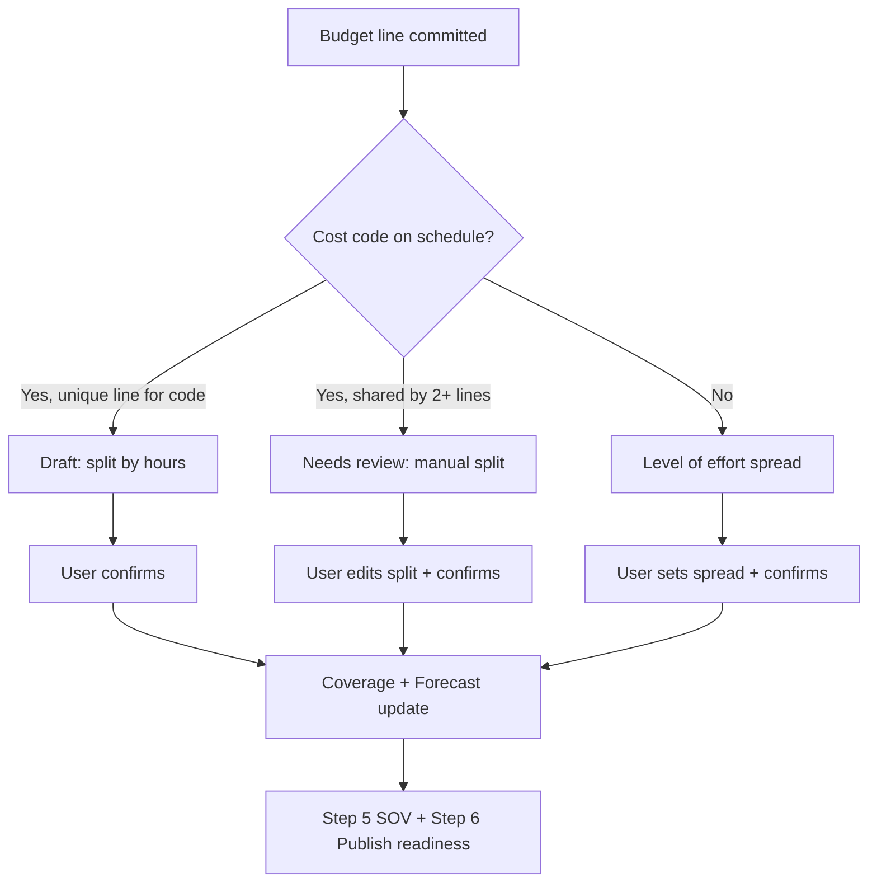

# Schedule Linking & Allocation — Feature Brief

**Purpose:** Explain Step 4 of Linarc Financials so you can discuss scope, trade-offs, and roadmap with your manager.  
**In the app:** **Schedule Linking & Allocation** (setup Step 4 · sidebar **Allocate**)

---

## One-sentence summary

After budget lines are **committed**, this step **cost-loads the project schedule** by matching each line to schedule tasks via **CSI cost code**, splitting the line's dollar amount across those tasks, and producing a **time-phased cash-flow forecast**—the bridge between internal budget and owner billing (SOV).

---

## Where it sits in the workflow

Linarc uses a **6-step financial setup**. Schedule Linking & Allocation is **Step 4**, between Budget and SOV:

| Step | Name | What happens |
|------|------|----------------|
| 1 | Preliminary Config | Retainage, billing rules, approvals |
| 2 | Prime Contract | Contract sum + line items (no cost codes) |
| 3 | Budget Setup | Cost-coded budget lines; **commit** when ready |
| **4** | **Schedule Linking & Allocation** | **Spread committed budget across schedule tasks** |
| 5 | Schedule of Values | Owner-facing billing lines (draft) |
| 6 | Publish SOV | Readiness checklist → publish to owner |

**Important design choice:** Steps 4 and 5 are **not blocked by "100% budget locked."** Work starts **as soon as lines are committed**—matching how teams often cost-load incrementally rather than waiting for a full budget freeze.

**Downstream gate:** Publishing SOV (Step 6) requires **every committed line** to be fully allocated and **confirmed** on the schedule.

---

## Industry context (why this step exists)

In construction PM, this maps to established practice:

| Concept | Industry norm | Linarc implementation |
|---------|---------------|----------------------|
| **Cost-loaded schedule** | Assign budget/cost to activities for cash flow, draws, EV (Primavera, MS Project, Procore-style linking) | Dollar amounts split across tasks by cost code |
| **Cost code as join key** | CSI MasterFormat (or WBS) links estimate ↔ schedule ↔ SOV | Budget `costCode` ↔ schedule task `costCode` |
| **Resource-based spread** | Cost follows planned labor/hours on activities | Default: **Split by planned hours** |
| **Level of effort (LOE)** | G&A, contingency, overhead with no discrete activity—spread over project dates | **Level of effort** path when no matching task |
| **Time-phased budget / S-curve** | Monthly spend + cumulative curve for draw timing | **Forecast** tab with monthly buckets + draw thresholds |
| **SOV vs internal budget** | SOV is owner billing; budget is contractor cost control—related but different views | Allocation happens **before** SOV mapping (Step 5) |

This step answers: *"When will we spend this committed budget, given the current schedule?"*—not *"What do we bill the owner?"* (that's SOV).

---

## Prerequisites (what must exist first)

1. **At least one committed budget line** — sidebar **Allocate** stays disabled until then.
2. Each committed line should have:
   - **Cost code** (required at commit; also the auto-match key)
   - **Subcontractor** (required at commit; shown as a chip on each allocation card)
   - **Budget amount** (the total to spread)
3. **A project schedule** with tasks that carry cost codes (in the prototype: imported mock schedule ~64 tasks). Tasks with **blank cost codes** (e.g. Mobilization) are excluded from cost loading.

Open or pending budget lines do **not** appear in this step.

---

## The connector: cost code

Matching is **automatic and deterministic**:

```
Budget line (committed)  ──cost code──►  Schedule task(s)
     $50,000 · 09 91 00                      Unit 101 Paint, Unit 102 Paint, …
```

- One cost code can map to **many tasks** (e.g. paint across multiple units).
- **Multiple budget lines** can share one cost code → **collision** (user must manually split tasks between lines).
- **No matching task** → **Level of effort** (spread over contract/project timeline, not per activity).

This mirrors how GC tools tie estimate lines to schedule activities without forcing a 1:1 mapping.

---

## Auto-match logic (what the system does on its own)

When a line is committed, the app runs `autoMatchBudgetToSchedule`:

| Situation | System behavior | User sees |
|-----------|-----------------|-----------|
| Unique cost code + matching task(s) | **Draft** link; amount split **by planned hours** across all matching tasks | Green path: review → Confirm |
| Same cost code on **2+ budget lines** | **Needs review**; no auto split (collision) | Warning: "Cost code shared with … — split the tasks" |
| Cost code with **no schedule task** | **Needs review** + **Level of effort** method | Purple "Level of effort" chip |
| Line already linked, user edited | Existing link **preserved** when budget syncs | Prior confirmations kept |

Existing links are reconciled when new lines commit (`syncScheduleLinks`)—same pattern as SOV draft mapping.

---

## Allocation methods (user options)

Each committed line gets one **distribution method**:

| Method | When used | How dollars split |
|--------|-----------|-------------------|
| **By planned hours** (default) | Unique cost-code match | Weighted by each task's `plannedHours`; remainder on last task for penny balance |
| **Split equally** | User choice | Even split across all matching tasks |
| **Manual** | Collisions, mixed unit/common work, fine tuning | User picks tasks (checkboxes), enters amounts; must sum to line total (±$0.01) |
| **Level of effort** | No matching schedule task | Whole line spread **evenly by calendar day** across contract start→end (or schedule span) |

### Manual split helpers

In **Edit split**, quick actions include:

- By hours / Equally
- **Unit tasks only** / **Common areas only** (when both exist in the group—e.g. unit interiors vs corridor work)
- **Distribute remaining** (fills zero-amount selected tasks with leftover balance)

### Per-line actions

- Method dropdown: hours vs equal (recalculates draft allocations)
- **Edit split** → save → switches to manual
- **Confirm link** — enabled only when allocated total = line amount (or LOE spread is set)
- **Confirm all matches (N)** — bulk-confirms all **draft** lines that are fully allocated

---

## Line status model

Each budget–schedule link has a status:

| Status | Meaning |
|--------|---------|
| **Draft** | Auto-matched; allocations complete; awaiting confirmation |
| **Needs review** | Collision or missing task; user decision required |
| **Confirmed (Linked)** | User accepted; counts toward coverage and publish readiness |

**Fully allocated** means:

- Task-based: sum of task allocations = line budget (±$0.01)
- LOE: user confirmed a date spread (`loeSpread`)

---

## UI: two views

### Lines tab

- One **card per committed line**: description, cost code, subcontractor, amount, status chip
- Expandable **mini-gantt**: matched tasks as duration bars (blue = allocated, grey = not; intensity = share)
- Header **coverage bar**: `$ linked of $ total` · confirmed / needs review / LOE counts

### Forecast tab

- **Cost-loaded cash-flow forecast** (monthly bars + cumulative S-curve)
- Each confirmed task allocation is **spread evenly across that task's start→end dates**
- LOE lines spread across their LOE window
- Overlays **contract draw thresholds** (25% / 50% / 75% / 100%) with projected months

Empty until at least some allocations are confirmed.

---

## What "done" means for Step 4

Step 4 is complete when **all committed lines** are **confirmed** and **fully allocated**.

That unlocks the publish checklist item:

> *"All committed lines allocated to the schedule"*

Unmet items link back to Step 4 from **Publish SOV**.

**Note:** SOV mapping (Step 5) can proceed in parallel in the UI, but **publish** requires both schedule allocation and SOV entries.

---

## End-to-end flow (diagram)



---

## Prototype vs production (discussion points)

Worth flagging with your manager:

| Topic | Current prototype | Typical production expectation |
|-------|-------------------|--------------------------------|
| Schedule source | Fixed mock schedule (`MOCK_SCHEDULE_TASKS`) | Import from P6, MSP, or native schedule module |
| Match key | Exact CSI string match | Normalization, aliases, WBS fallback |
| Persistence | Session-only (refresh resets) | Saved links per project |
| Schedule editing | Not in this step | May need re-sync when schedule revs |
| EV / actuals | Forecast only | Actual cost vs time-phased plan |

---

## Suggested discussion questions for your manager

1. **Incremental vs full lock:** Is per-line commit + incremental allocation the right model, or do we need a hard "budget 100% locked" gate before any allocation?
2. **Collision policy:** When two budget lines share a cost code, should the system suggest a default split (e.g. by line amount ratio) instead of forcing full manual review?
3. **LOE defaults:** Should unmatched lines default to contract dates, fiscal periods, or a user-picked window?
4. **Schedule ownership:** Who maintains the schedule, and how do we handle re-baseline after allocation is confirmed?
5. **SOV ordering:** Is cost-loading before SOV drafting correct for your customers, or do some workflows map SOV first?
6. **Forecast consumers:** Is the S-curve + draw projection sufficient for finance, or do we need export (CSV, ERP, lender reporting)?

---

## Quick reference — terms

| Term | Definition |
|------|------------|
| **Committed / locked line** | Budget row approved for downstream use (SOV, allocation, subs) |
| **Cost loading** | Assigning budget dollars to schedule tasks in time |
| **Level of effort** | Budget spread over time without task-level detail |
| **Coverage** | Dollar amount and count of confirmed links vs total committed |
| **Cost-loaded forecast** | Monthly spend derived from allocations + task/LOE dates |

---

## Related code & specs

- UI: `src/components/views/spreadsheetV4/BudgetScheduleLinker.tsx`
- Logic: `src/lib/scheduleLinking.ts`, `src/lib/cashFlow.ts`
- Product spec: `Financial_Workflow_PRD_and_UX_Spec_v2.4.md` (Step 4)
